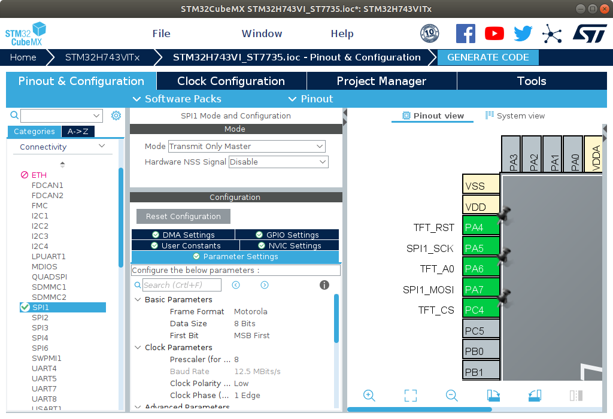
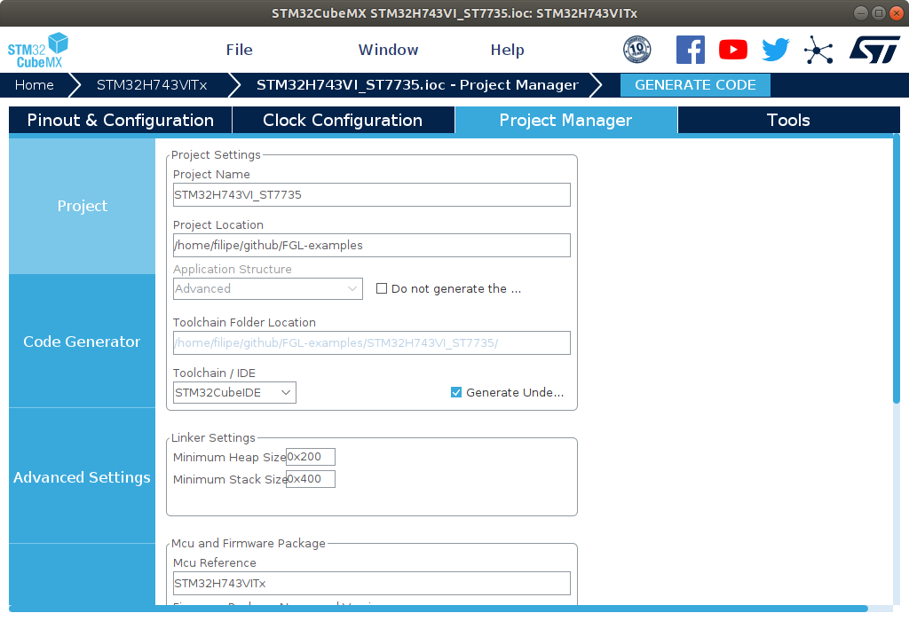
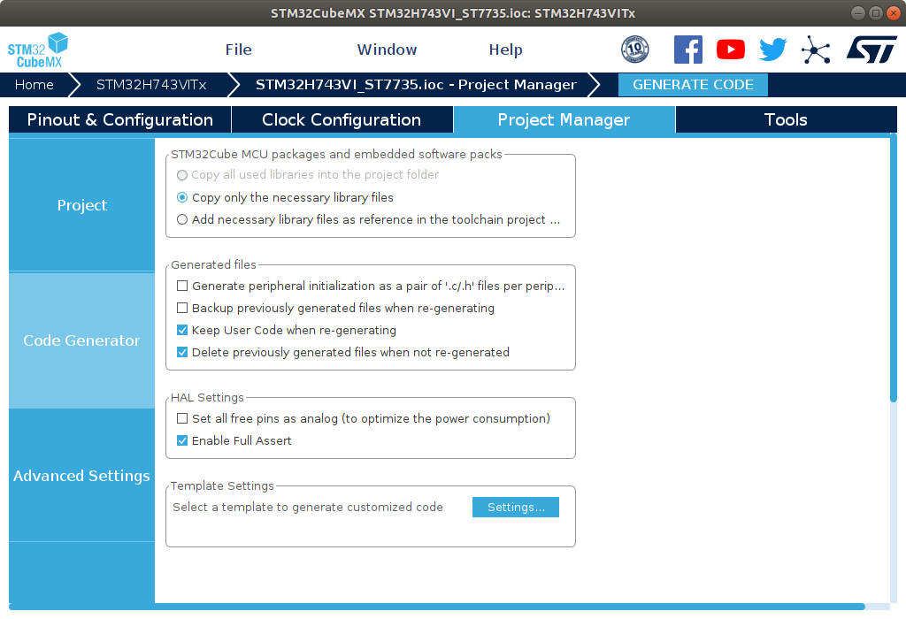
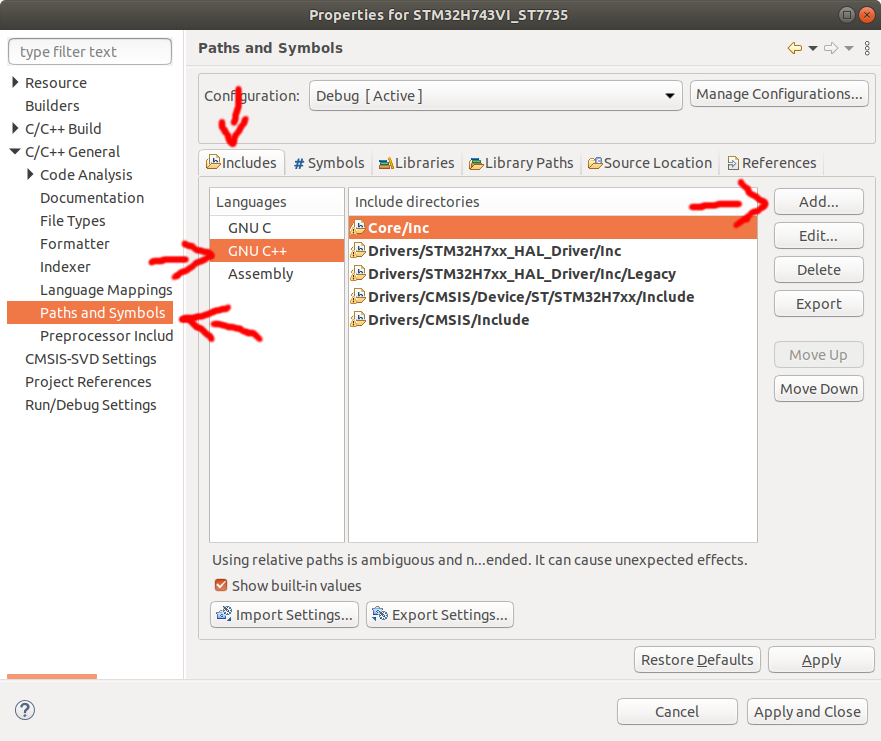
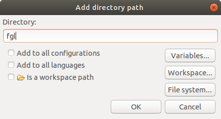
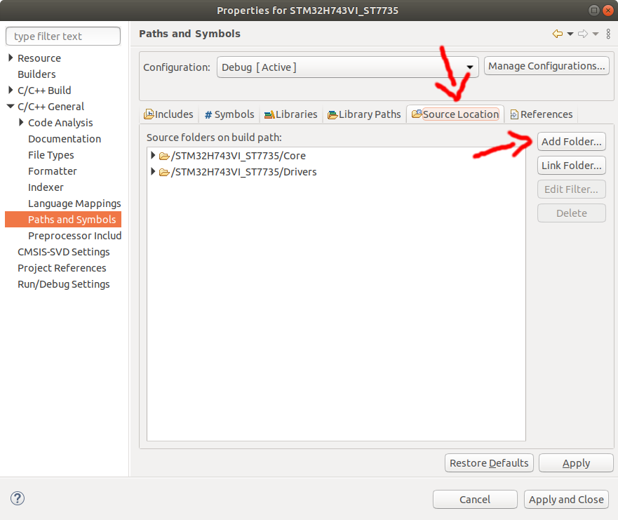
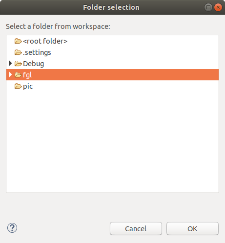

# FGL usage on STM32H743VI and ST7735

This example is a demonstration of how FGL can be used with STM32.

## Project creation step by step

### 1. HAL creation with STM32CubeIDE
 
 In the STM32CubeMX tool, choose the target microcontroller (STM32H743VI in our case). Configure the microcontroller as follows:

 1. Set three GPIOs as digital output for display pins **RST**, **CS** and **A0/DC**. In this example, the outputs have been labeled **TFT_RST**, **TFT_CS** and **TFT_A0**.
 2. Set an SPI communicator to **Transmit Only Master** mode, set the **prescaler** to **8** and **data size** to **8 bits**.



On the **Project Manager** tab, make the following settings: 

1. Choose the STM32CubeIDE toolchain/IDE
2. In **Advanced Settings -> HAL settings**, check the **Enable Full Assert** option.




Finally, generate the code and open the project with STM32CubeIDE.

### 2. Copying FGL to the project

1. Make a copy or symbolic link from the **FGL/lib** folder in the project folder and rename it to **fgl**.
2. Make a copy or symbolic link of the **FGL/platforms/STM32H7xx ST7735/stm32h7xx_st7735.hpp** file in **Core/Inc**.
3. Make a copy or symbolic link of the **FGL/platforms/STM32H7xx ST7735/stm32h7xx_st7735.cpp** file in **Core/Src**.

### 3. Project configuration on STM32CubeIDE

It is necessary to convert the generated code to C++. To do this, right-click on the open project and click **Convert to C++**.


Now you need to configure the project. With the project selected, press Alt+Enter or right-click the project and click **Properties**, you will open the project properties window. 

To add FGL to include paths, go to **C/C++ General -> Paths and Symbols**, select the **GNU C++** language and click **Add**.



With the **Add Directory Path** window open, type **fgl** and click **ok**.



Now go to the **Source Location** tab and click **Add Folder**.


With the **Folder Selection** window open, select the **fgl** folder and click **ok**.


Once all that is done, you can click **Apply and Close**.

### 4. Create the cpp_main function

1. In **Core/Inc/main.h**, add the ``void jump_to_cpp();`` declaration.
2. In **Core/Src/main.c**, call **jump_to_cpp** in the **main** function before the infinite loop.
3. In **Core/Src**, create a file called **cpp_main.cpp** and paste the following code.
4. Draw on the display using the methods of the **Pencil** class in the drawing section.

```c++
#include <main.h>
#include <stm32h7xx_st7735.hpp>
#include <pencil.hpp>

#define BACKCOLOR_R 0
#define BACKCOLOR_G 0
#define BACKCOLOR_B 0
#define BACKCOLOR Color(BACKCOLOR_R, BACKCOLOR_G, BACKCOLOR_B)

/* -- global code section -- */
extern SPI_HandleTypeDef hspi1;

STM32H7_ST7735 display(TFT_RST_GPIO_Port,
                       TFT_RST_Pin,
                       TFT_A0_GPIO_Port,
                       TFT_A0_Pin,
                       TFT_CS_GPIO_Port,
                       TFT_CS_Pin,
                       &hspi1);
/* ------------------------- */

void cpp_main()
{
	/* -- setup code section -- */
	display.init();
	display.drawArea(0, 0, display.getWidth()-1, display.getHeight()-2, BACKCOLOR_R, BACKCOLOR_G, BACKCOLOR_B);
	Pencil pencil(display);
	/* ------------------------ */

	/* -- drawing section -- */
	while(true)
	{
		/* -- loop code section -- */
		/* ----------------------- */
	}
	/* --------------------- */
}

extern "C" void jump_to_cpp()
{
	cpp_main();
}
```