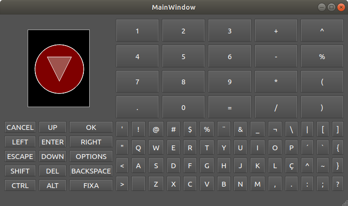

# Display simulation with Qt 5 and FGL



This example is an FGL simulation template with Qt 5. The IDE used is the Qt creator. The main window has buttons that are not used in this example, but that can be copied and used later (as mentioned, it is a template). Images are shown in a fixed-size QGraphicsView widget.

## Code

### MainWindow header

The MainWindow header follows the traditional Qt pattern, with the addition of ``void initFGLDisplay()``, ``void drawOnFGLDisplay()``, ``QtFGLDisplay *display`` and ``Pencil *pencil``.

```c++
#ifndef MAINWINDOW_H
#define MAINWINDOW_H

#include <QMainWindow>
#include <QScreen>

/* --- FGL includes --- */
#include <pencil.hpp>
#include <buffered_pencil.hpp>
#include <qt_fgl_display.hpp>
/* -------------------- */

QT_BEGIN_NAMESPACE
namespace Ui { class MainWindow; }
QT_END_NAMESPACE

class MainWindow : public QMainWindow
{
    Q_OBJECT

public:
    MainWindow(QWidget *parent = nullptr);
    ~MainWindow();

    void initFGLDisplay(); //Initialize FGL display simulation
    void drawOnFGLDisplay(); //Draw on FGL display
private:
    Ui::MainWindow *ui;

    QtFGLDisplay *display; //Pointer to FGL display instance
    Pencil *pencil; //Pointer to FGL pencil instance

};
#endif // MAINWINDOW_H
```

### MainWindow source

```c++
#include "mainwindow.h"
#include "ui_mainwindow.h"

#define ENABLE_ALPHA_AND_ANTIALIASING true
#define BACKCOLOR_R 0
#define BACKCOLOR_G 0
#define BACKCOLOR_B 0

MainWindow::MainWindow(QWidget *parent)
    : QMainWindow(parent)
    , ui(new Ui::MainWindow)
{
    ui->setupUi(this);
    this->initFGLDisplay();
    this->drawOnFGLDisplay();
}

MainWindow::~MainWindow()
{
    delete this->pencil;
    delete this->display;
    delete ui;
}

void MainWindow::initFGLDisplay()
{
    // Get screen DPI
    QScreen *srn = QApplication::screens().at(0);
    float dpiX = srn->logicalDotsPerInchX();
    float dpiY = srn->logicalDotsPerInchY();

    // Instantiate the FGL display
    this->display = new QtFGLDisplay(this->ui->graphicsView->width(), this->ui->graphicsView->height(), dpiX, dpiY);

    // Use the graphicsView widget as display
    this->ui->graphicsView->setScene(&this->display->scene);

    // Fill display with black
    this->display->drawArea(0, 0, this->ui->graphicsView->width()-1, this->ui->graphicsView->height()-1, BACKCOLOR_R, BACKCOLOR_G, BACKCOLOR_B);

    // Instantiate the FGL pencil
    Color backcolor(BACKCOLOR_R, BACKCOLOR_G, BACKCOLOR_B);
    this->pencil = (ENABLE_ALPHA_AND_ANTIALIASING) ? new BufferedPencil(*this->display, backcolor) : new Pencil(*this->display);
}

void MainWindow::drawOnFGLDisplay()
{
    float w = this->ui->graphicsView->width(); //Display width
    float h = this->ui->graphicsView->height(); //Display height

    this->pencil->fillCircle(w/2, h/2, 50, Color(0.5,0,0)); //Circle filling
    this->pencil->drawCircle(w/2, h/2, 50, Color(1,1,1)); //Circle contour
    this->pencil->drawCircle(w/2, h/2, 50.5, Color(1,1,1)); //Circle contour

    float triangle_x[3] = {w/2-25, w/2+25, w/2};
    float triangle_y[3] = {h/2-25, h/2-25, h/2+25};
    this->pencil->fillPolygon(triangle_x, triangle_y, 3, Color(0.1,1,1,1)); //Triangle filling
    this->pencil->drawPolygon(triangle_x, triangle_y, 3, Color(1,1,1)); //Triangle contour
}

```